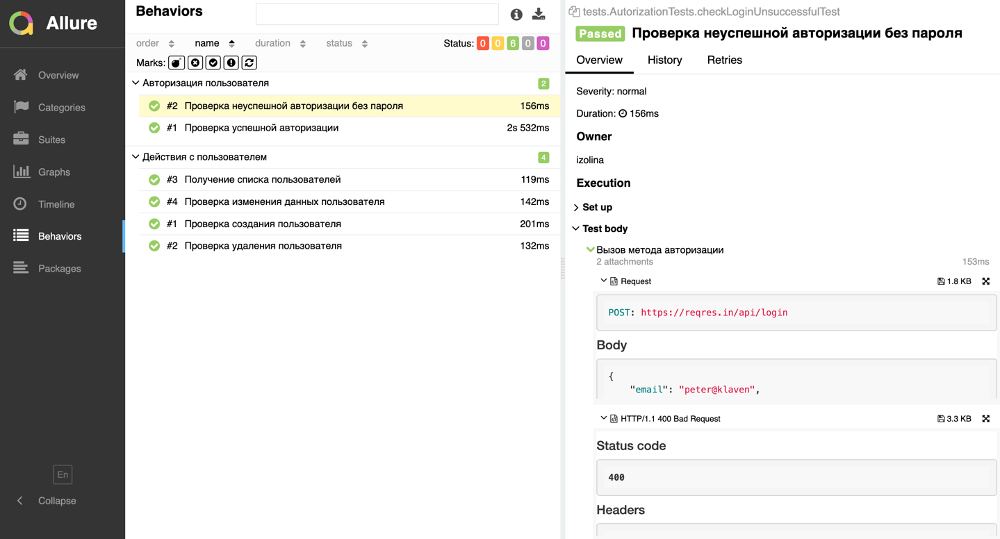

# Демо проект по автоматизации тестирования API на [reqres.in](https://reqres.in/)
<p align="center">

</p>

##  Содержание:

> ➠ [Технологический стек](#технологии-и-инструменты)
>
> ➠ [Покрытый функционал](#покрытый-функционал)
>
> ➠ [Запуск из терминала](#Запуск-тестов-из-терминала)
>
> ➠ [Сборка в Jenkins](#Сборка-в-Jenkins)
>
> ➠ [Пример Allure-отчета](#Пример-Allure-отчета)


## Технологии и инструменты

<p align="center">
<a href="https://www.jetbrains.com/idea/"></a>
<a href="https://www.java.com/"></a>
<a href="https://github.com/"></a>
<a href="https://junit.org/junit5/"></a>
<a href="https://gradle.org/"></a>
<a href="https://www.jenkins.io/"></a>
<a href="https://allurereport.org/"></a>
<a href="https://qameta.io/"></a>
<a href="https://web.telegram.org/"></a>
</p>
В данном проекте автотесты написаны на <code>Java</code>.

## Покрытый функционал

> Разработаны автотесты:

- [x] Создание нового пользователя
- [x] Получение списка пользователей
- [x] Изменение данных пользователя
- [x] Удаление пользователя
- [x] Изменение данных пользователя (не полное)

##  Запуск тестов из терминала

```
gradle clean test
```

## Сборка в [Jenkins](https://jenkins.autotests.cloud/job/HW_API_22/)
Для запуска сборки необходимо перейти в раздел <code>Build Now</code>

<p align="center">

</p>

После выполнения сборки, в блоке <code>Build History</code> напротив номера сборки появится значок <code>Allure Report</code> кликнув по которому, откроется страница с сформированным html-отчетом.

## Пример [Allure-отчета](https://jenkins.autotests.cloud/job/diplom_api/3/allure/)
### Overview

<p align="center">

</p>

### Результат выполнения теста

<p align="center">

</p>