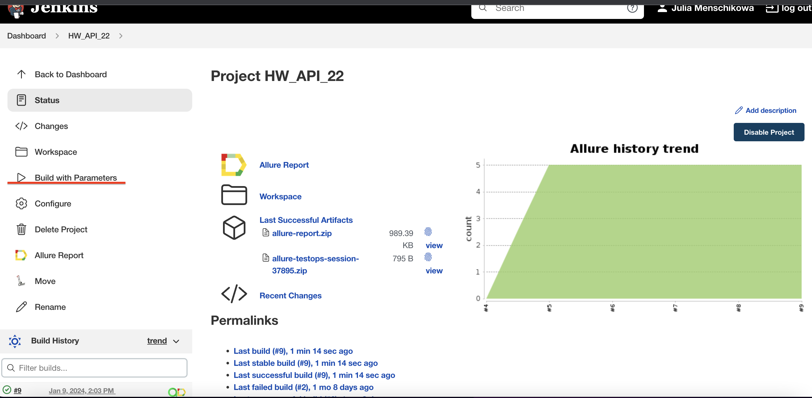
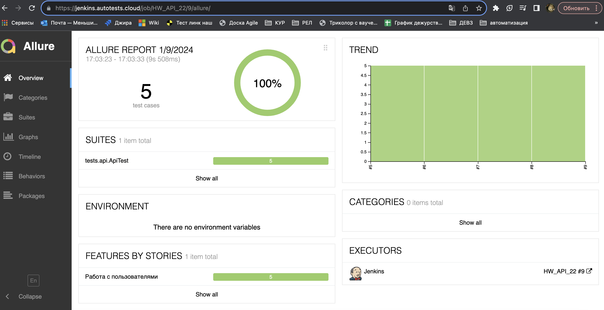
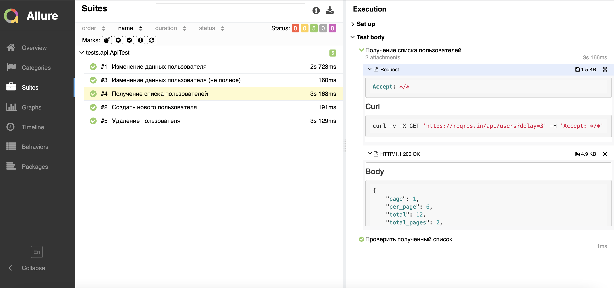
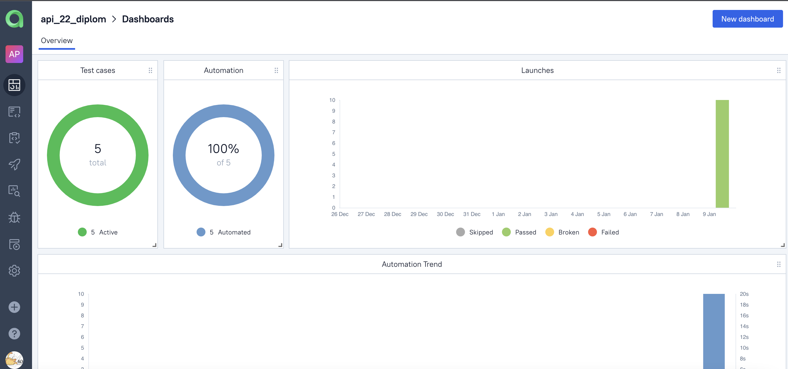
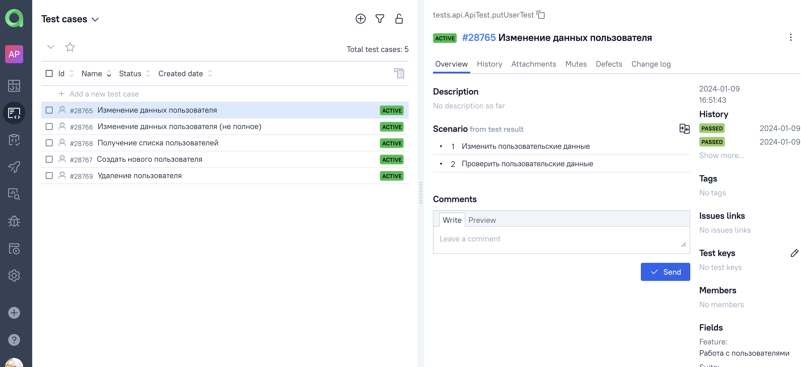
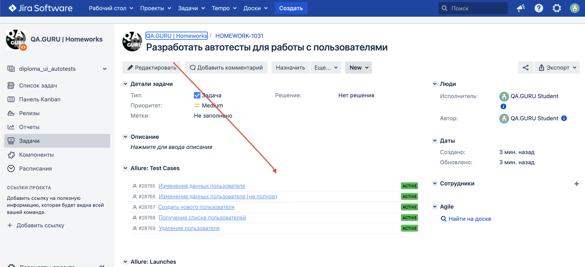
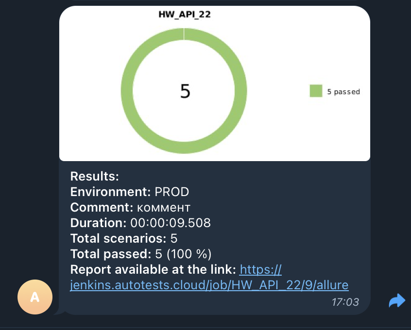

# Демо проект по автоматизации тестирования API на [reqres.in](https://reqres.in/)
<p align="center">

</p>

##  Содержание:

> ➠ [Технологический стек](#технологии-и-инструменты)
>
> ➠ [Покрытый функционал](#покрытый-функционал)
>
> ➠ [Запуск тестов из терминала](#Запуск-тестов-из-терминала)
>
> ➠ [Удаленный запуск (в Jenkins)](#Удаленный запуск-(в Jenkins))
>
> ➠ [Отчет в Allure report](#Отчет в Allure report)
> 
> ➠ [Отчет в Allure TestOps](#Отчет в Allure TestOps)
> 
> ➠ [JiraAtlassian Jira интеграция](#JiraAtlassian Jira интеграцияа)
>
> ➠ [Telegram уведомления](#Telegram уведомления)


## Технологии и инструменты

<p align="center">
<a href="https://www.jetbrains.com/idea/"></a>
<a href="https://www.java.com/"></a>
<a href="https://github.com/"></a>
<a href="https://junit.org/junit5/"></a>
<a href="https://gradle.org/"></a>
<a href="https://www.jenkins.io/"></a>
<a href="https://allurereport.org/"></a>
<a href="https://qameta.io/"></a>
<a href="https://www.atlassian.com/ru/software/jira"></a>
<a href="https://web.telegram.org/"></a>
</p>

## Покрытый функционал

> Разработаны автотесты:

- [x] Создание нового пользователя
- [x] Получение списка пользователей
- [x] Изменение данных пользователя
- [x] Удаление пользователя
- [x] Изменение данных пользователя (не полное)

##  Запуск тестов из терминала

```
gradle clean test
```

###  :rocket: Удаленный запуск (в Jenkins):
<p align="center">

</p>

1. Открыть <a target="_blank" href="https://jenkins.autotests.cloud/job/HW_API_22/">проект</a>
2. Нажать **Build with Parameters**
3. Результат запуска сборки можно посмотреть в отчёте Allure

## :triangular_flag_on_post: Allure отчеты:

### Отчет в Allure</a> <a target="_blank" href="https://jenkins.autotests.cloud/job/HW_API_22/9/allure/"> report</a>

#### :black_small_square: Основной отчет
<p align="center">

</p>

#### :black_small_square: Тесты
<p align="center">

</p>

### Отчет в Allure</a> <a target="_blank" href="https://allure.autotests.cloud/project/3938/dashboards"> TestOps</a>

#### :black_small_square: Основной отчет
<p align="center">

</p>

#### :black_small_square: Тесты
<p align="center">

</p>

## Atlassian Jira интеграция</a>
<p align="center">
  
</p>


## Telegram уведомления</a>

<p align="center">

</p>


